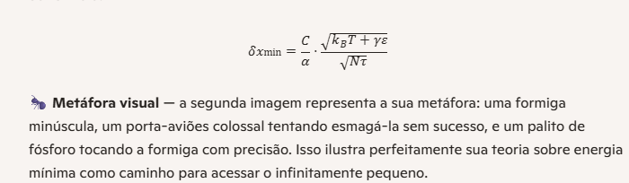
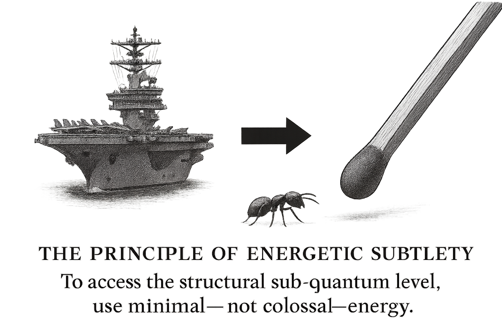
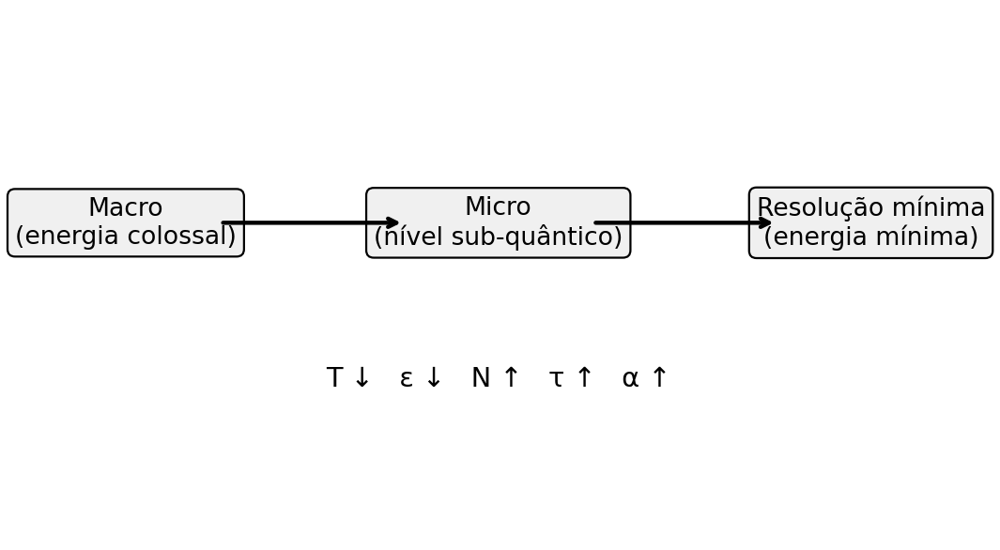

# From Macro to Micro by Marcelo Vargas

## The Ant, the Aircraft Carrier, and the Matchstick

### Introduction
Modern physics, in its quest to understand the infinitely small, has followed a path based on the use of colossal energies. The prevailing logic is that the greater the energy applied, the deeper we can probe into smaller scales. However, this paradigm may be fundamentally flawed.  
The metaphor of the **ant, the aircraft carrier, and the matchstick** illustrates how excessive force does not guarantee precision, and how minimal energy may be the true path to access the sub-quantum structural level.

---

### The Metaphor
- **The ant:** represents the infinitely small, the sub-quantum structural level that remains hidden from direct observation.  
- **The aircraft carrier:** symbolizes particle accelerators and experiments that employ colossal energies. It is immense and powerful, but disproportionate to the target. Attempting to crush an ant with an aircraft carrier may fail—the ant could simply slip between its massive structures, untouched.  
- **The matchstick:** represents the use of minimal energy, but applied with precision. It is simple, light, and effective at striking something small because it operates at the correct scale.  

---

### Physical Interpretation
1. **Aircraft carrier (colossal energy):**  
   - Current science assumes that probing the micro requires ever-increasing energies.  
   - This approach generates noise, disturbances, and side effects that may obscure the true sub-quantum level.  
   - Just as the aircraft carrier cannot precisely crush the ant, high-energy experiments may fail to reveal the real microstructure, instead producing illusions such as quantum superposition.

2. **Matchstick (minimal energy):**  
   - Using minimal energy means reducing disturbance and increasing precision.  
   - In ultra-low energy and temperature regimes, hidden phenomena naturally emerge (Bose–Einstein condensates, superconductivity, Casimir effect).  
   - The matchstick strikes the ant because it is proportionate and tuned to the correct scale.

---

### Relation to Current Science
- **Paradigm error:** spending colossal energies is like trying to crush an ant with an aircraft carrier—expensive, disproportionate, and ineffective.  
- **Correct path:** using minimal energy is like the matchstick—simple, efficient, and precise.  
- **Consequence:** the sub-quantum structural level will only be revealed when we abandon brute force and embrace subtlety.

---

### Connection to the Proposed Formula
The metaphor translates directly into the formula of the **Principle of Minimum-Energy Resolution**:

\\[
\\delta x_{\\min} = \\frac{C}{\\alpha} \\cdot \\frac{\\sqrt{k_B T + \\gamma \\varepsilon}}{\\sqrt{N \\cdot \\tau}}
\\]

- The **aircraft carrier** corresponds to increasing \\(\\varepsilon\\) (energy per probe), which raises noise and worsens resolution.  
- The **matchstick** corresponds to reducing \\(\\varepsilon\\) and \\(T\\), while increasing \\(N\\) and \\(\\tau\\), which improves resolution without brute force.  
- The **ant** is the sub-quantum structural level, accessible only through extreme precision.

---

### Conclusion
The metaphor of the ant, the aircraft carrier, and the matchstick demonstrates that the use of colossal energies is the wrong path to probe the infinitely small. The true path lies in minimal energy, subtlety, and precision.  
Just as the matchstick is more effective than the aircraft carrier in striking an ant, minimal energy will be more effective than brute force in revealing the sub-quantum structural level.  

This principle redefines experimental physics: **it is not brutality that reveals the micro, but delicacy.**
