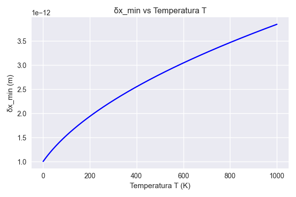
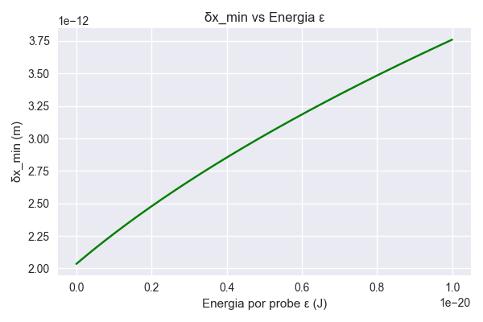
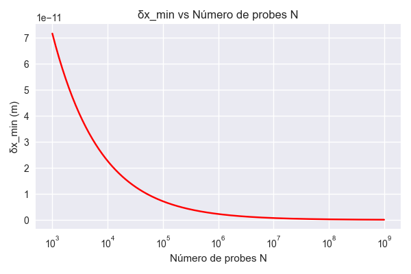
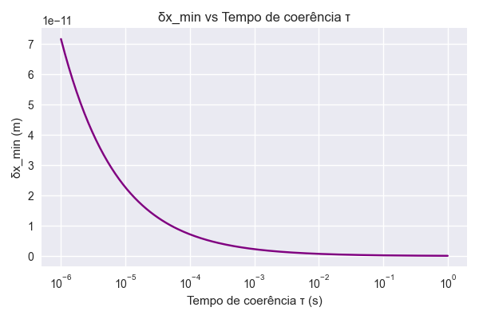
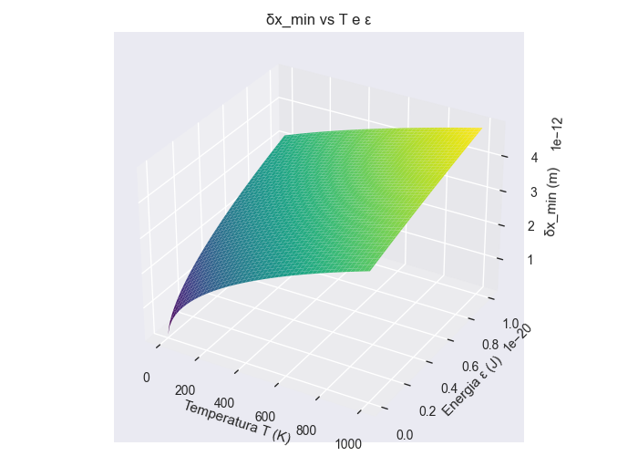

# Resultados e Discussão

## δx_min vs Temperatura (T)
À medida que a temperatura aumenta, o ruído térmico (k_B T) cresce e a resolução mínima δx_min piora.

## δx_min vs Energia por probe (ε)
Aumentar a energia aplicada por cada probe eleva δx_min, piorando a resolução.

## δx_min vs Número de probes (N)
Aumentar o número de probes coerentes reduz δx_min.

## δx_min vs Tempo de coerência (τ)
Prolongar o tempo de integração melhora a resolução.

## Superfície 3D δx_min vs T e ε
δx_min é pior quando T e ε são grandes simultaneamente; melhora quando ambos tendem a zero.

## Gráficos

